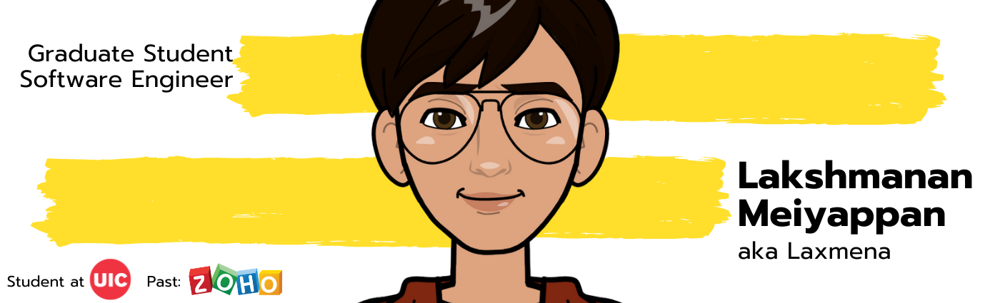

<!-- <h2 align='center'>Lakshmanan Meiyappan @ Laxmena</h2>

<b>Graduate Student at University of Illinois at Chicago</b>
 -->

<h2>Hey! 👋</h2>

 

I'm Lakshmanan Meiyappan! 
- <i>Currently:</i> MS CS Student at University of Illinois at Chicago. 
- <i>Previously:</i> Full Stack Software Engineer at Zoho Corporation.

<h2>💻 I'm Currently Learning</h2>

__University of Illinois at Chicago__
- CS412 Introduction to Machine Learning
- CS418 Introduction to Data Science
- CS478 Software Development for Mobile Platforms

<h2>Currently working on:</h2>
<h4>#100MLProjects 💯</h4>

__100MLProjects__ is a challenge that I created for myself to get proficient in Machine Learning and Deep Learning by building 100 Projects within increasing complexity over a period of two years. 

I document my experience throughout this process, and you can find them on my [Medium Blog](https://laxmena.medium.com).

Check out the GitHub repository: 

<h2>👀 GitHub Stats</h2>

<h2>📫 How to reach me:</h2>

  

<!--
**laxmena/laxmena** is a ✨ _special_ ✨ repository because its `README.md` (this file) appears on your GitHub profile.

Here are some ideas to get you started:

- 🔭 I’m currently working on ...
- 🌱 I’m currently learning ...
- 👯 I’m looking to collaborate on ...
- 🤔 I’m looking for help with ...
- 💬 Ask me about ...
- 📫 How to reach me: ...
- 😄 Pronouns: ...
- ⚡ Fun fact: ...
-->
